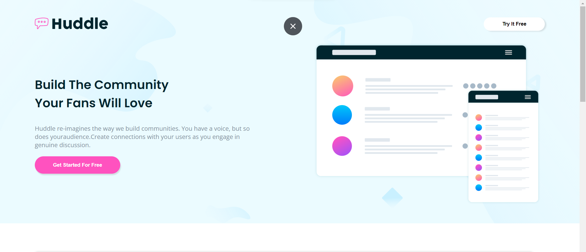
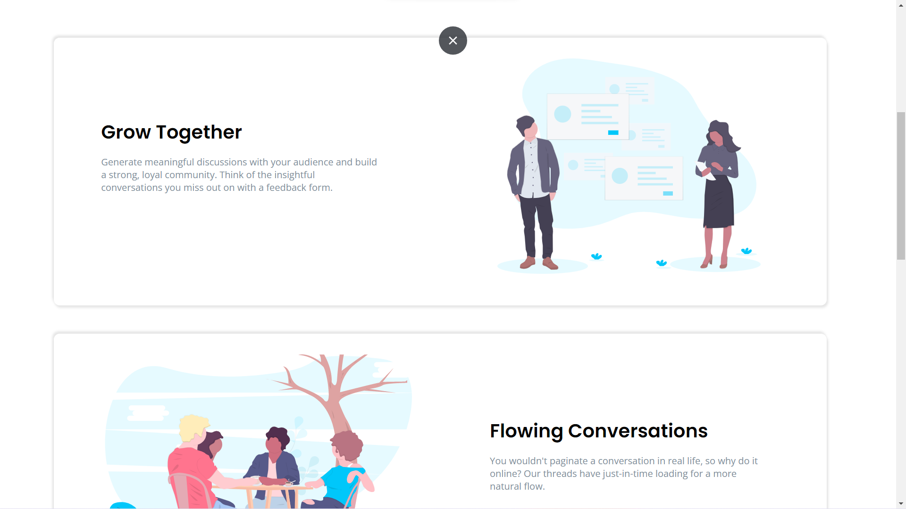
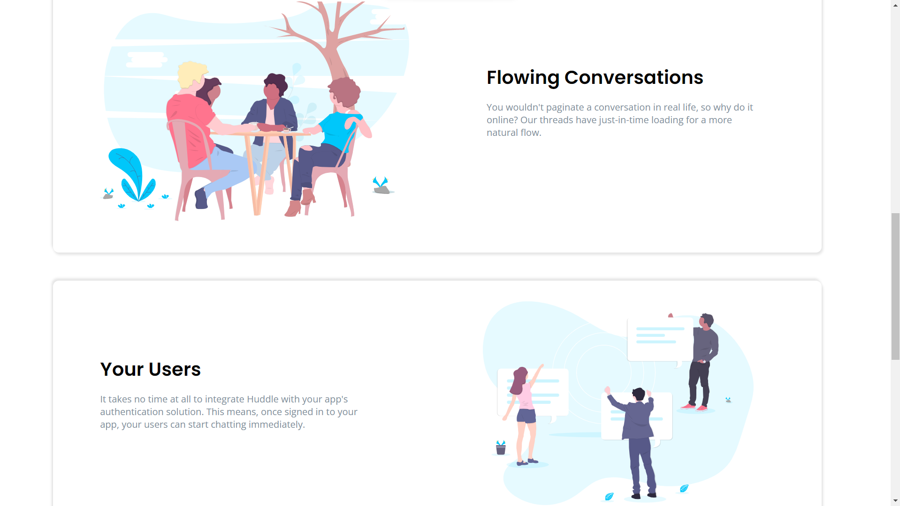
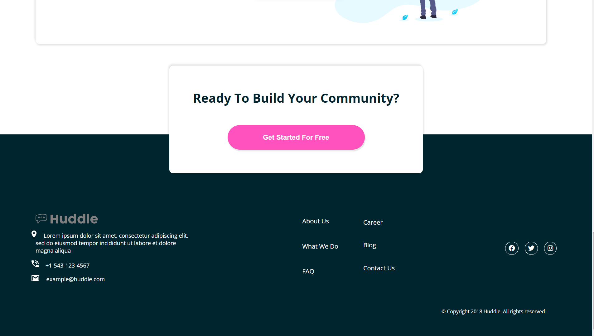
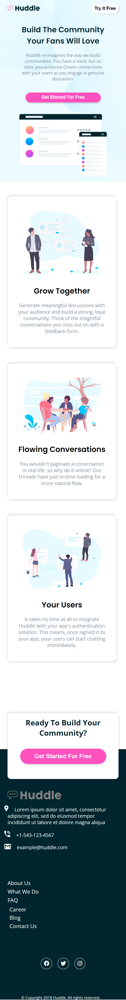

# Huddle-landing-page

# Frontend Mentor - Huddle landing page with alternating feature blocks solution

This is a solution to the [Huddle landing page with alternating feature blocks challenge on Frontend Mentor](https://www.frontendmentor.io/challenges/huddle-landing-page-with-alternating-feature-blocks-5ca5f5981e82137ec91a5100). Frontend Mentor challenges help you improve your coding skills by building realistic projects. 

## Table of contents

- [Overview](#overview)
  - [The challenge](#the-challenge)
  - [Screenshot](#screenshot)
  - [Links](#links)
- [My process](#my-process)
  - [Built with](#built-with)
  - [What I learned](#what-i-learned)
  - [Continued development](#continued-development)
  - [Useful resources](#useful-resources)
- [Author](#author)

## Overview

### The challenge

Users should be able to:

- View the optimal layout for the site depending on their device's screen size
- See hover states for all interactive elements on the page

### Screenshot







### Links

- Solution URL: [https://github.com/AmanGupta1703/Huddle-landing-page]
- Live Site URL: [https://amangupta1703.github.io/Huddle-landing-page/]

## My process

### Built with

- Semantic HTML5 markup
- CSS custom properties
- Flexbox

### What I learned

```html
<main class="container">
    
    <!-- Features Section -->
    <section id="features">
      <!-- Item 1 -->
      <div class="feature-item">

        <div class="feature-text-content order-m-2">

          <h2 class="small-heading fw-700">Grow Together</h2>

          <p class="feature-text fw-400">Generate meaningful discussions with your audience and build a strong, loyal
            community.
            Think of the insightful conversations you miss out on with a feedback form. </p>

        </div>

        <div class="feature-banner order-m-1">

          

        </div>

      </div>

      <!-- Item 2 -->
      <div class="feature-item">

        <div class="feature-text-content flex-order-2 order-m-2">

          <h2 class="small-heading fw-700">Flowing Conversations</h2>

          <p class="feature-text w-80 fw-400">You wouldn't paginate a conversation in real life, so why do it online?
            Our
            threads
            have just-in-time loading for a more natural flow.</p>

        </div>

        <div class="feature-banner flex-order-1 order-m-1">

          

        </div>

      </div>

      <!-- Item 3 -->
      <div class="feature-item">

        <div class="feature-text-content order-m-2">

          <h2 class="small-heading fw-700">Your Users</h2>

          <p class="feature-text fw-400">It takes no time at all to integrate Huddle with your app's authentication
            solution.
            This means, once signed in to your app, your users can start chatting immediately.</p>

        </div>

        <div class="feature-banner order-m-1">

          

        </div>

      </div>

    </section>

    <!-- Subscription -->
    <section id="subscription">
      <div class="subs-text">

        <h1 class="big-heading subs-heading">Ready To Build Your Community?</h1>

        <button class="btn-header subs-btn fw-700">Get Started For Free</button>

      </div>
    </section>

  </main>
```
```css
#features {
  margin: 2rem 0 6rem;
  padding: 3% 6%;
  display: flex;
  gap: 3rem;
  flex-direction: column;
  justify-content: center;
}

/* grow-item-box */
.feature-item {
  background-color: var(--white);
  border-radius: 10px;
  box-shadow: 2px 4px 4px var(--bs-color), -2px -4px 4px var(--bs-color);
  font-family: var(--ff-primary);
  display: flex;
  padding: 0 0 4% 6%;
  width: 98%;
  min-height: 50vh;
}

.feature-text-content {
  display: flex;
  flex-direction: column;
  justify-content: center;
}

.small-heading {
  font-family: var(--ff-secondary);
  font-size: 2rem;
}

.feature-text {
  color: var(--grayish-blue);
  font-size: 1rem;
  margin: 1rem 0 0;
  width: 70%;
}

.w-80 {
  width: 80%;
}

.feature-banner {
  display: flex;
  align-items: center;
}

.feature-banner img {
  padding: 2.2rem 0 0;
  width: 80%;
}

.flex-order-1 {
  order: 1;
}

.flex-order-2 {
  order: 2;
}

/* Subscription Section */
#subscription {
  font-family: var(--ff-secondary);
  padding: 3% 6%;
  display: flex;
  justify-content: center;
  position: relative;
  z-index: 1;
  margin: 1rem 0 0;
}

.subs-text {
  background-color: var(--white);
  box-shadow: 2px 4px 4px var(--bs-color), -2px -4px 4px var(--bs-color);
  border-radius: 10px;
  padding: 4% 4%;
  position: absolute;
  bottom: -100px;
  z-index: 4;
}

.subs-heading {
  font-family: var(--ff-primary);
  font-size: 2rem;
  text-align: center;
  width: 100%;
  margin-bottom: 3rem;
}

.subs-btn {
  display: block;
  margin: 0 auto;
  font-size: 1.1rem;
  width: 22rem;
  padding: 4% 5%;
}
```


### Continued development

1) FlexBox 
2) Position 
3) Responsive Design

### Useful resources

- [W3School - FlexBox](https://www.w3schools.com/css/css3_flexbox.asp)
- [W3School - Position](https://www.w3schools.com/css/css_positioning.asp)

## Author

- Website - [Huddle Landing Page](https://amangupta1703.github.io/Huddle-landing-page/)
- Frontend Mentor - [@AmanGupta1703](https://www.frontendmentor.io/profile/AmanGupta1703)
